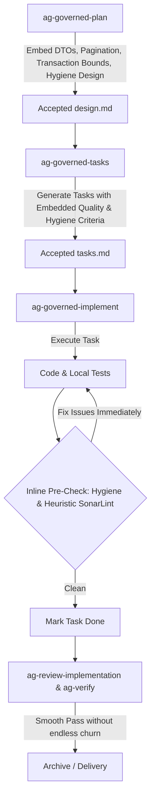

# Technical Design: Shift-Left Quality and Hygiene in Architecture Guard

## Overview
This design integrates SonarLint code-quality rules and repository hygiene rules into the planning (`ag-governed-plan`), task breakdown (`ag-governed-tasks`), and implementation execution (`ag-governed-implement`) skills, along with template updates in `.architecture-guard/templates/`.

## Architecture & Workflow Strategy

## Detailed Enhancements

### 1. `ag-governed-plan` Skill
- Add a new section / requirement in **Required Active Inputs & Design Rules**:
  - Proactively identify:
    - Bounded collection reads / pagination strategy.
    - Explicit DTO envelopes for controller responses.
    - Parameter validation boundaries (e.g. UUID, sanitization).
    - Failure-safe transaction boundaries.
    - Repository hygiene rules (declaring exact target paths, no temporary comparison files).

### 2. `ag-governed-tasks` Skill
- Enhance **Task Generation Rules**:
  - Tasks must include concrete acceptance criteria reflecting code quality:
    - Strict typing and discriminated unions.
    - Explicit DTO mapping.
    - Localized test, lint, and typecheck commands.
    - Task-level hygiene confirmation (no leftover debug code or temporary files).

### 3. `ag-governed-implement` Skill
- Update **Step 3 (Orchestrate Implementation)**:
  - Add an explicit **Inline Task Self-Verification Gate** before checking off each task `[x]`:
    1. Check changed files against `.architecture-guard/hygiene-rules/`.
    2. Check changed files against `.architecture-guard/sonar-rules/sonarlint-rules.json` heuristically.
    3. Correct any detected drift or violations immediately at the owning task boundary.

### 4. Templates & Core Contract (`.architecture-guard/templates/ponytail_core.md`)
- Add explicit shift-left quality and hygiene principles to Construction Rules:
  - Zero tolerance for temporary/comparison files left in the tree.
  - Fix quality, typing, and validation at the earliest rung, not in post-hoc reviews.

## Risk & Security Assessment
- **Risk**: Adding overhead during implementation.
- **Mitigation**: Keep inline pre-checks heuristic, lightweight, and focused strictly on the changed files of the current task.
